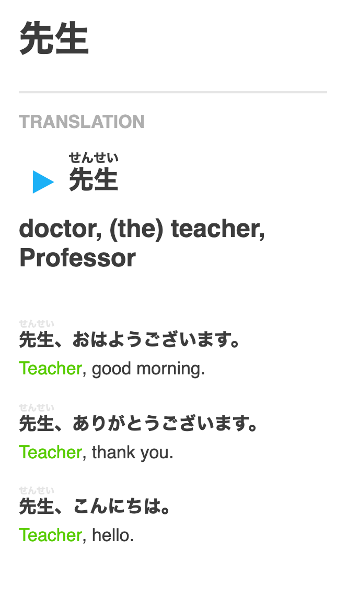

# Duolingo Words

Export your (Japanese) Duolingo vocabulary into an usable format, e.g. Anki deck

## Current Progress

- only usable with Japanese language
- Furigana support but due to missing context, it's not always correct
- there isn't any CLI yet and the only export format is Anki
